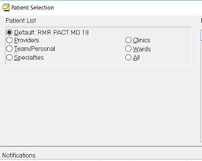

# Opioid Manager CDS

Opioid Manger is a Clinical Decision Support (CDS) program to manage urine drug screenings and naloxone prescriptions in long
term opiate populations within CPRS.

## Naloxone and UDS (Urine Drug Screen) Batch Processor

For a group of long-term opioid patients, Nalxone/UDS orders and mail out letters are automatically generated if overdue

### Automated Process

1. Opens VSSC report website (see Notes) so that a comma separated file filtered for a given provider and opioid therapy type can be generated. 

2. After selecting saved CSV file, program reads list of patient names in a csv file and determines whether to skip patient based on dates last
ordered (13 months for Naloxone, 5 months for UDS) and skipping palliative care patients (for UDS)

3. Waits for Patient Selection page on CPRS (so provider can finish CPRS tasks started before program was ran):

4. Opens chart in CPRS of selected patient on list and tries to
close/wait for popups to be manually closed

   - For UDS, checks to see if there’s already an existing UDS order within last month and will try to go to next patient if order exists

5. Creates order for naloxone/UDS

6. Creates follow-up note (using the CPRS template that auto mails out to the patient) with naloxone/UDS info

7. Waits for provider to review/sign-off on both the order and note and to go to the Patient Selection box

8. Reads next name on list and repeats until list is complete

Notes:

Works only for Rocky Mountain Regional VA Medical Center (but can be localized to other centers), uses CPRS letter writer and auto-adds 00-Location.

NaloxoneBatch.ahk and UDSBatch.ahk are the main scripts respectively.

Create CSV (comma separated value) file of patients with ssn that require naloxone/UDS. Can be done through this site (primary care almanac, requires VA intranet access):

https://securereports2.vssc.med.va.gov/ReportServer/Pages/ReportViewer.aspx?%2fPC%2fAlmanac%2fPAIN_ProviderCPRS&rs:Command=Render&rc:Parameters=true

If script seems to stumble at various steps, go ahead and try to click on tab of next step and the script should pickup from there.  I’m still working on making
it more reliable.

### Next Steps

- Add multi-physician functions

  - Create pending orders/notes under primary opioid prescriber so they can review/sign-off as view alert on CPRS

  - Manage prescriber buy-in will be complex and require time to consider least intrusive design and ongoing changes based on feedback

  - Need to account for providers who opt out, and keep track of which
providers have been sent alerts on X number of patients per timeframe

  - Consider 1-2 patients/wk/provider on a low view alert day until
providers are familiar with the program

  - Draft emails and survey/feedback mechanisms to customize
frequency for each provider

  - Store this info on a local database (likely will use JSON, but
reviewing other formats)

  - Analyze before/after conditions-improvement in number of
patients compliant with UDS/naloxone, and prescriber satisfaction

- Add prompts to enter last dates cutoffs

- Auto populate VSSC report and auto download CSV file so step 1 will be transparent

- Add more flexibility to the CSV columns accepted (currently hard-coded by column number)

- Improve reliability and recovery of outlying conditions

- Create similar program for PDMP (Prescription Drug Monitoring Program) management

- After inquiring about API usage, would require licensee agreement and BAA with Appriss Health
